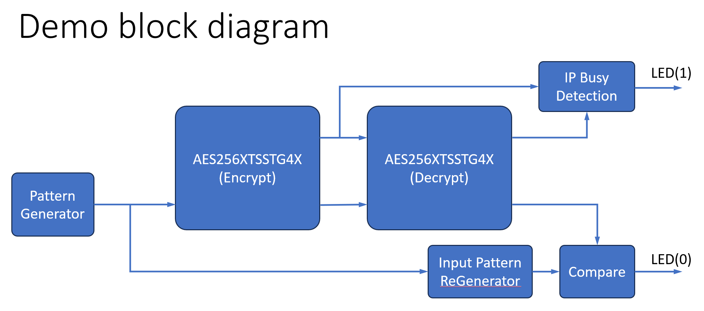

# AES256-XTS-STG-4x free evaluation demo

This repository contains source code and a brief description of the AES256-XTS-STG-4x demo from Design Gateway's product.

## Basic information

1. The IP and project are not provided in this repository. Please contact [Design Gateway](https://dgway.com/index_E.html) to obtain this free evaluation project.
2. The source code of this project is publicly available to demonstrate how to use this IP.
3. Design Gateway Co., Ltd. makes no claims, promises, or guarantees regarding the use of this free project. 
4. This evauluation demo includes a timeout limit.

## Project description
The AES256-XTS-STG IP Core supports 256-bit AES encryption and decryption with XEX (XOR Encrypt XOR) tweakable block cipher, targetting storage applications that prioritize data confidentiality. More details about this IP can be found through this [link](https://dgway.com/ASIP_E.html#AESXTS).

In addition to this free evaluation demo, we also offer another demo application where this IP is applied in an actual environment with a storage system. If you are interested in testing the full system, please contact us. This free demo, however, includes a simple system that demonstrates how our encryption IP core functions. The illustration below shows the overall system of this free demo, with more details described further below.



Two AES256-XTS-STG-4x IP cores are used in this system — one serving as an encrypter and the other as a decrypter. The encrypter is fed input data by the pattern generator, and the output of the encrypter is then forwarded to the decrypter. Ideally, the input data before encryption and the output data after decryption should be the same. This concept is verified using a comparator to check the two data feeds — the regenerated input data and the output data from the decrypter. If the two data sets do not match, the LED(0) is asserted to be '1'. On the other hand, LED(1) is asserrted to indicate the current busy status of the two IP cores in this system.

The project directory is briefly explained below.
```
├───docs - documents and their associated objects 
└───source 
    ├───ip - directory for the encrypted IP file
    └───hdl-top - HDL files of this project
```

